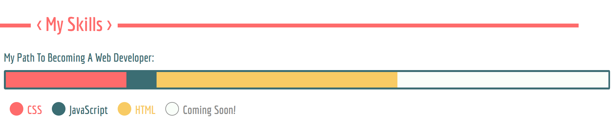
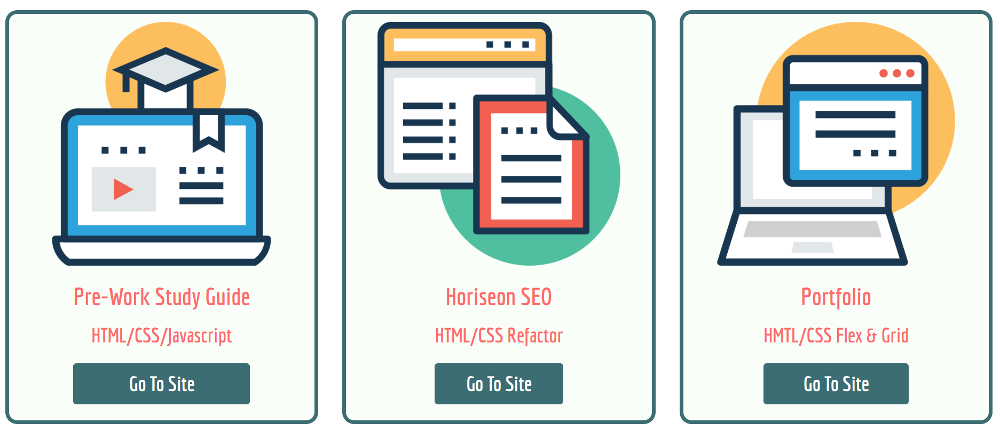

# Bootstrap Portfolio

## Description
The motivation behind this challenge was to recreate the portfolio of the previous challenge and enhance it further through the use of Bootstrap and its accompanying components. Although the functionality of this new portfolio is the same, the skills I have learnt whilst using Bootstrap, I felt as though the design could be better meaning the design has changed. Throughout this challenge, I have learnt the following:
- How to import Bootstrap and its components into a HTML document.
- How to use CSS styling to customise Bootstrap components.
- How to make webpages responsive through the use of Bootstrap's Grid.
- How to utilise buttons and/or icons throughout a webpage.

#

## Table Of Contents
- [Usage](#usage)
- [Credits](#credits)
- [Deployment](#deployment)
- [License](#license)

## Usage
Just as the portfolio from the previous challenge created in the previous challenge, the new Bootstrap portfolio has the following navigational links:
- Work
- About
- Contact

However to meet the requirements of this challenge, a new section and subsequent navifational link has been added. This is as follows:
- Skills

This can be seen in the screenshot below:

When each link is clicked, the user is taken to the corresponding sections of the page as seen below:

Bootstrap's Grid and Cards have been used to create a tiled effect to display the example work projects with the first three having active links to deployed URLS:

Bootstrap's progress bar has also been used within the Skills section to give the user a visual representation of my current skill set. This has also been labeled to the corresponding colors:

Throughout the web page, buttons have been utilised to navigate the user to external sources such as deployed sites and linked social media accounts:

The footer has further buttons that take the user to my social media accounts, an email functionality and to my phone number. Each button has a hover effect and box shadow, further highlighting the user to what link they are on:

The "Get In Touch" Button featured in the Jumbotron, takes the user to a modal with a contact form nested as seen below:

Finally the web page is fully responsive to all screensizes using Bootstrap components, such as Grid and Navigational Bar with toggle menu:

#

## Credits
Throughout working on this challenge, I sought the knowledge and advice from multiple sources including:
- https://www.w3docs.com/snippets/css/how-to-import-google-fonts-in-css-file.html
- https://blog.hubspot.com/website/css-border-radius-circle
- https://www.w3schools.com/css/css_list.asp
- https://www.w3schools.com/cssref/sel_hover.php

#

## Deployment
Below is the link to the deployed web page using GitHub Pages:

https://maccersm8.github.io/Bootstrap-Portfolio/

#

## License
Copyright (c) 2022 Maisie McDonald

Permission is hereby granted, free of charge, to any person obtaining a copy
of this software and associated documentation files (the "Software"), to deal
in the Software without restriction, including without limitation the rights
to use, copy, modify, merge, publish, distribute, sublicense, and/or sell
copies of the Software, and to permit persons to whom the Software is
furnished to do so, subject to the following conditions:

The above copyright notice and this permission notice shall be included in all
copies or substantial portions of the Software.

THE SOFTWARE IS PROVIDED "AS IS", WITHOUT WARRANTY OF ANY KIND, EXPRESS OR
IMPLIED, INCLUDING BUT NOT LIMITED TO THE WARRANTIES OF MERCHANTABILITY,
FITNESS FOR A PARTICULAR PURPOSE AND NONINFRINGEMENT. IN NO EVENT SHALL THE
AUTHORS OR COPYRIGHT HOLDERS BE LIABLE FOR ANY CLAIM, DAMAGES OR OTHER
LIABILITY, WHETHER IN AN ACTION OF CONTRACT, TORT OR OTHERWISE, ARISING FROM,
OUT OF OR IN CONNECTION WITH THE SOFTWARE OR THE USE OR OTHER DEALINGS IN THE
SOFTWARE.
